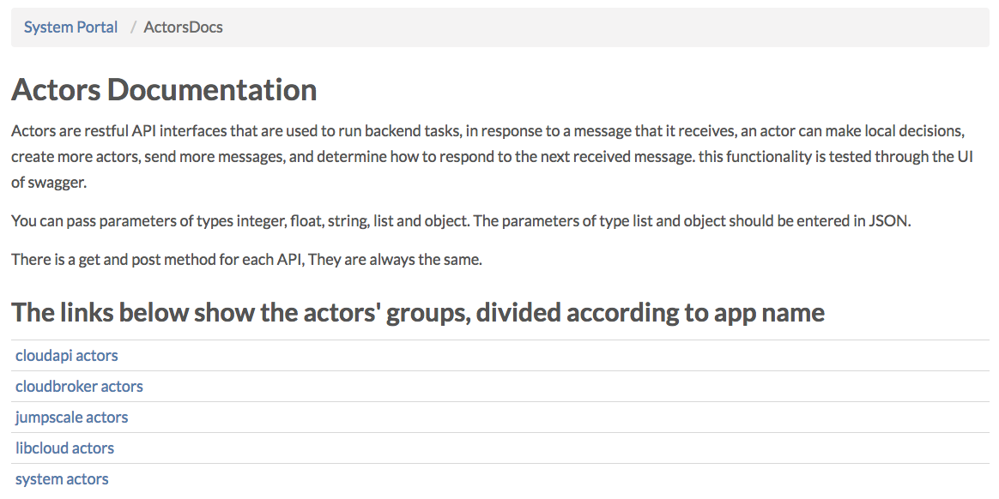

# API

Clicking "API" in the **System Portal** brings you to the **Actors Documentation** page:

Here you find five actor categories, only the first two are supported:

* **CloudAPI** actors: the API publicly available to all users
* **CloudBroker** actors: API available only to administrators, providing the functionality as available from the Cloud Broker Portal and the Grid Portal

The three other API groups are only for internal use:

* **JumpScale** actors: internal API for managing the firewalls
* **LibCloud** actors: internal API used during configuration and setup
* **System** actors: all other internal system APIs

All the APIs are described in the [OpenAPI Specification](https://en.wikipedia.org/wiki/OpenAPI_Specification).

Through the [Swagger UI](https://swagger.io/swagger-ui/) you can interact with them, here for the **Add User** API endpoint:

While all documentation for using this API is nicely included in this Swagger API console, you can also create a static HTML web page for the API documentation as documented in [Create Static HTML Page for API Documentation](https://github.com/gaeldestrem/docs-1/tree/6e9bf0cd755ed9fcfd39b1e52ec5e2fbda4125cb/docs/API/OpenAPI2HTML.md).

In order to get stared with the Cloud API check [Getting started with the OpenvCloud Cloud API](gettingstarted-1.md).

