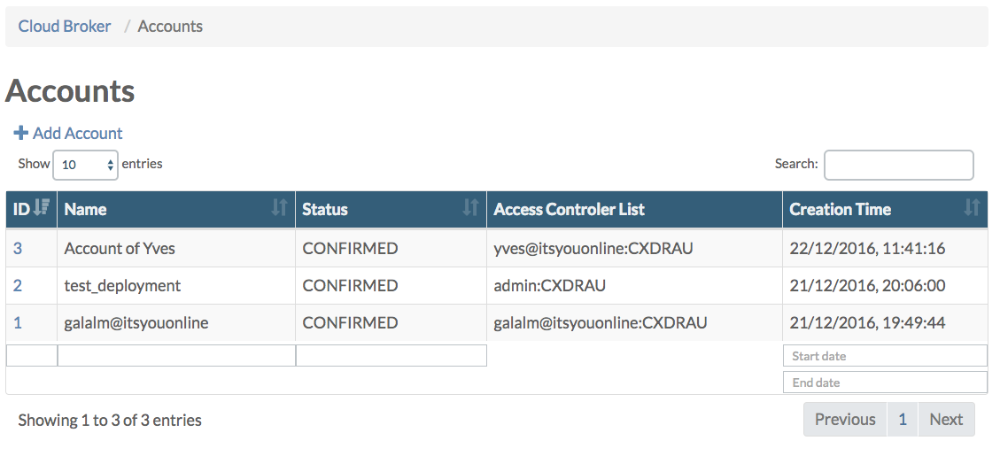
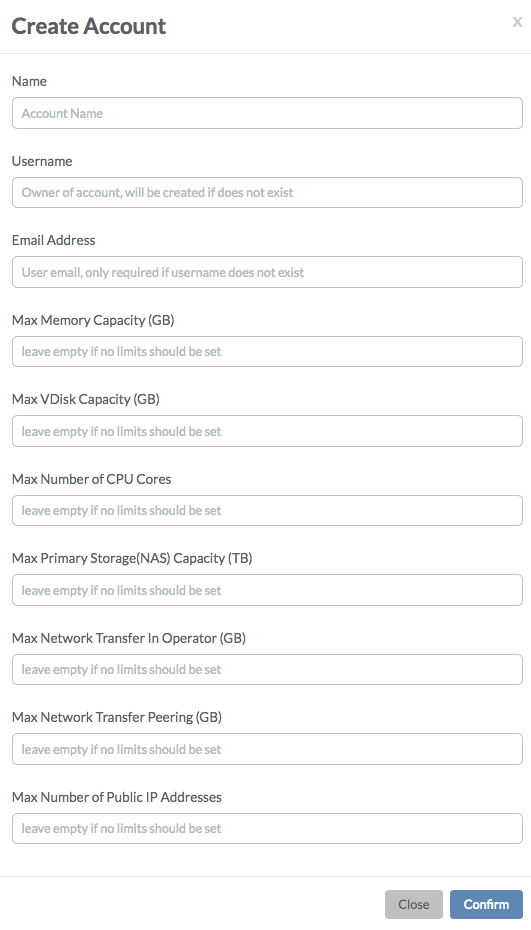
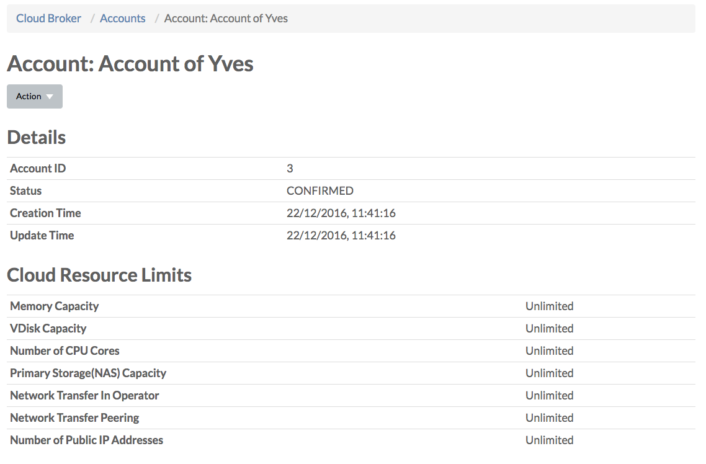
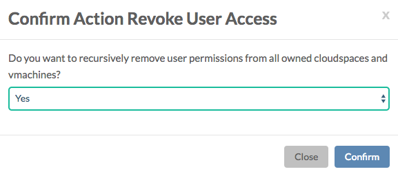
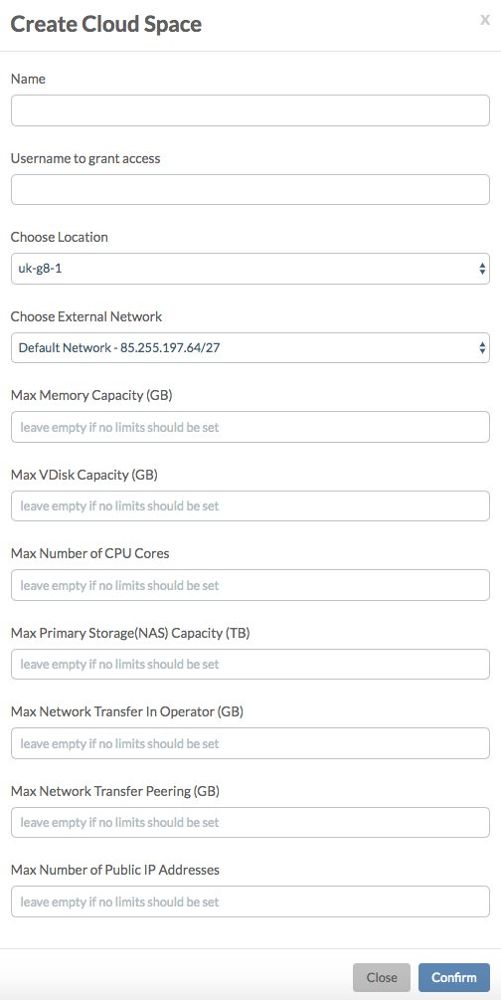

# Accounts

In order for a user to get access to actual cloud resources he needs to have access rights to an account.

The **Accounts** page lists all existing accounts:

## Creating Accounts

Clicking the **+ Add Account** link allows you to create a new account:

If the username you specify doesn't exist yet, a new user will be created, and an activation e-mail will be send to the e-mail address you specify, allowing the user to set his password. In case the user already exists, you can leave the e-mail address field empty.

All the other fields are for setting limits on the total available capacity for the new account:

* **Memory Capacity** for limiting the total amount of memory \(GB\) that can be used by all cloud spaces in the account
* **Virtual Disk Capacity** for limiting the total \(boot + data\) disk capacity \(GB\) used by all virtual machines created in the account
* **Number of Virtual CPU Cores** for limiting the total number of virtual CPU cores used by all virtual machines created in the account
* **Number of Public IP Address** for limiting the total number public IP address assigned available for assigning to cloud spaces and virtual machines

## Account Details

Clicking the **ID** of an account in the accounts table links to the **Account Details** page for that account:

From the **Actions** dropdown menu you can:

* Edit the account
* Disable the account
* Delete the account

Under **User Access** all users that have access to the account are listed:

You can grant other users access to the account by clicking the **+ Grant User Access** link, which will show the **Confirm Action Grant User Access** dialog:

A user can have **read**, **write** or **admin** privileges. See the [End User Portal Authorization Model](../enduserportal/authorizationmodel.md) documentation for all details on this.

Click the **X** allows you to revoke user access:

Under **Cloud Spaces** all cloud spaces belonging to the account are listed:

The **+ Add Cloud Space** link allows you to add a cloud space to the account:

Also here you can specify capacity limits, this time specific only to the new cloud space.

In addition here you to set the external network to which the cloud space needs to be connected.

From the list with cloud spaces you can navigate to the **Cloud Space Details** pages.

For more information on **Cloud Spaces** go to the [Cloud Spaces](cloudspaces.md) documentation.

And finally under **Audits** all REST API calls for the account are listed:

For more information on **Audits** go to the [Audits](../gridportal/audits.md) documentation.

