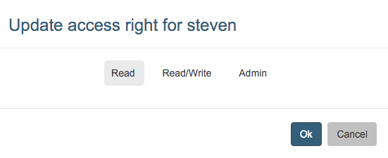
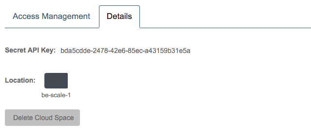

# Cloud Space Settings

In order to access the settings of your cloud space, first select the cloud space and then click the **Cloud Space Settings** link, both in the top navigation bar, respectively left and right:

## Access Management

Here users with administrative rights can configure who has access to your cloud space, and what their specific privileges are.

Who has administrative rights?

* Any user that was granted administrative privileges at the **account** level
  * The owners of the account, that are the users that were specified when the account got created, automatically get the administrative privileges at the account level
    * Accounts can be created via the Rest API
    * Accounts can not be created in the **End User Portal**, you need access to the **Accounts** page in the **Cloud Broker Portal**
  * Other users can be added via the REST API or on the **Account Details** page in the **Cloud Broker Portal**, see the [Accounts](../cloudbrokerportal/accounts.md) documentation for this
* Any user that was granted administrative privileges at the **cloud space** level
  * This can be done here, on the **Cloud Space Settings** page
  * This can also be done on the **Cloud Space Details** page in the **Cloud Broker Portal**, see the [Cloud Space](../cloudbrokerportal/cloudspaces.md) documentation for this

So you don't need access to the **Cloud Broker Portal** in order to grand cloud space rights to existing users. For new users however you will first need to create them, and this access to the **Cloud Broker Portal** is required; this will change starting with version 2.0.3 ver OpenvCloud.

In the example shown above, the logged in user, has "Admin" rights on the cloud space level, and thus can add other users to the cloud space, granting them Read, Read/Write, or Admin rights. For instance below you grand "Read" access to the user with username "steven":

When you click **Add**:

You can always remove a user or change their privileges:

For a general overview of the authorization model, and the exact meaning of "Read", "Write" and "Admin" check the [Authorization Model](authorizationmodel.md) documentation.

## Details

On the **Details** tab the API key and the location are shown:

Clicking the **Delete Cloud Space** button allows you to delete the cloud space:

