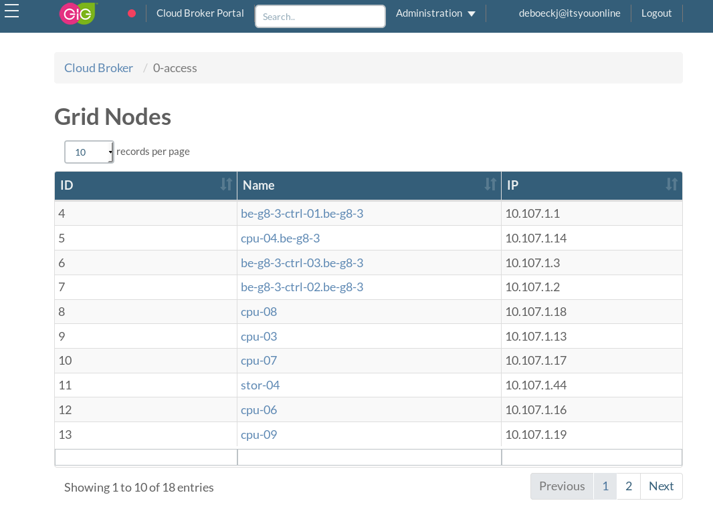
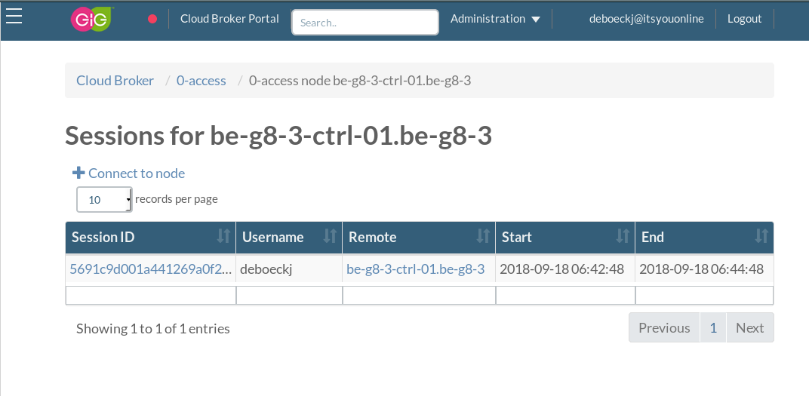

# 0-Accesst

0-Access is running as a pod part of the kubernetes cluster on the controllers. Authentication trough 0-Access is handled trough OpenvCloud using the public keys configured in the user's itsyou.online profile.

We can see sessions per nodes by clicking on a node from this list. 

The same page also allows starting a new session to this node.

